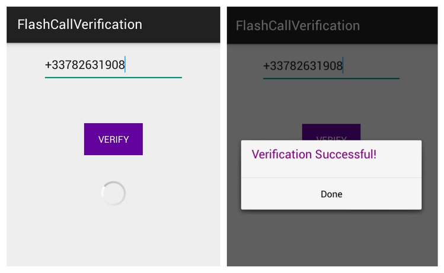
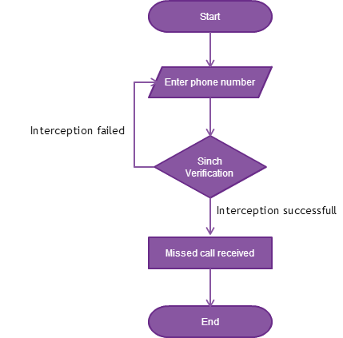
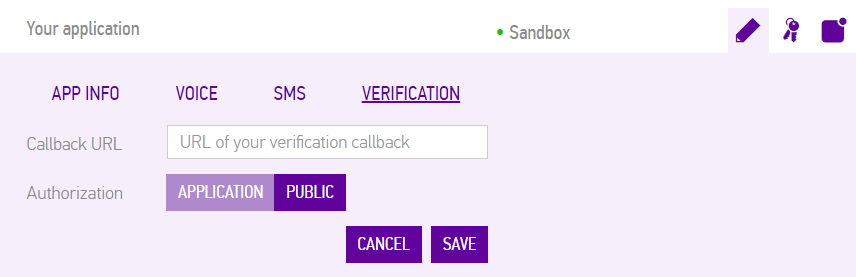
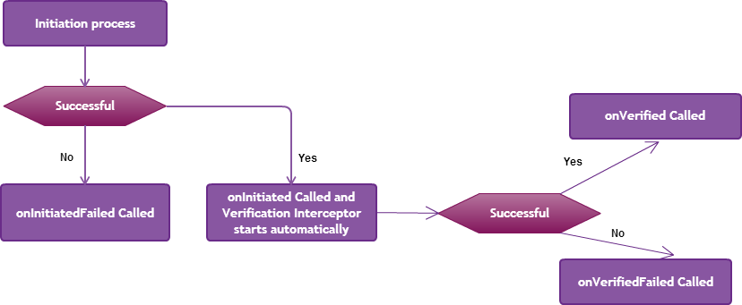

<h1>Verify Phone Numbers – Flash Call Verification</h1>

<p>This tutorial will show you how to verify your users with no interaction required from the user in two minutes. This uses the <a href="https://www.sinch.com/tutorials/android-flash-call-verification/?utm_source=sinch&utm_medium=xlink&utm_campaign=verifyflashcallsinch">Sinch Flash Call technology</a> for Android, and lets you ensure that a user is in possession of a phone number by relying on the regular phone network.</p>

For more [Verification Tutorials](https://www.sinch.com/tutorials/?tags%5B%5D=verification&utm_source=sinch&utm_medium=xlink&utm_campaign=verifyall)

<p>By the end of this tutorial, your app will look similar to this:</p>

<p>The following workflow summarizes how the app is operating.</p>



##Setup

<p>If you haven’t done so yet, set up a developer account with <a href="https://www.sinch.com/dashboard/#/signup">Sinch</a>. You will need to create an app in the developer portal. Be sure to <b>enable Verification</b> as follows:</p>

<p>Hold on to the app key generated by this service; you will need it in a few minutes.</p>
<b>Note: </b>In order to use the verification SDK, you should have some credits in your account. But don't worry, Sinch offers $2 in free credits when you verify your phone number.
<p>Go to your Dashboard in the account tab and verify your phone number. You will receive a prompt SMS with your code verification.</p>

##Flash Call Verification

<p>Now, let's start coding. Create a new project in your IDE and choose <b>VerificationActivity</b> as a name of your <b>LauncherActivity</b>.</p>
<p>Download the Sinch Verification SDK at <a href="http://www.sinch.com/android-verification-sdk">Verification SDK</a> and add it to your project.</p> 
<p>Sinch Flash Call Verification SDK requires a few permissions. Add the following to your <b>AndroidManifest</b> file:</p>

```objective-c

	<uses-permission android:name="android.permission.INTERNET" />
    <uses-permission android:name="android.permission.READ_CALL_LOG" />
    <uses-permission android:name="android.permission.READ_PHONE_STATE" />
    <uses-permission android:name="android.permission.CALL_PHONE" />
````

<p>In your <b>activity_verification</b> layout file, add the following Views:</p>

```objective-c

	 <EditText
        android:layout_width="wrap_content"
        android:layout_height="wrap_content"
        android:inputType="phone"
        android:ems="10"
        android:id="@+id/phoneNumber"
        android:layout_alignParentTop="true"
        android:layout_centerHorizontal="true" />

    <Button
        android:layout_width="wrap_content"
        android:layout_height="wrap_content"
        android:text="Verify"
        android:id="@+id/verify"
        android:layout_marginTop="63dp"
        android:textColor="#ffffffff"
        android:layout_below="@+id/phoneNumber"
        android:layout_centerHorizontal="true" />

    <ProgressBar
        android:layout_width="wrap_content"
        android:layout_height="wrap_content"
        android:id="@+id/progressBar"
        android:layout_centerVertical="true"
        android:layout_centerHorizontal="true"
        android:visibility="invisible" />
````

<p>In <b>onCreate</b> method, we need to start the Flash Call Verification process when the user enters his or her phone number and clicks on the verify button.</p>
```objective-c

	super.onCreate(savedInstanceState);
    setContentView(R.layout.activity_main);

    numberPhone = (EditText) findViewById(R.id.phoneNumber);
    verify = (Button) findViewById(R.id.verify);
    progressBar = (ProgressBar) findViewById(R.id.progressBar);

    verify.setOnClickListener(new View.OnClickListener() {
        public void onClick(View v) {
            String number = numberPhone.getText().toString();
            if(number.isEmpty()) {
                Toast.makeText(getApplicationContext(), "Phone number cannot be empty!",Toast.LENGTH_LONG).show();
           }
            else {
                showProgressDialog();
                startVerification(number);
            }
        }
    });
````


<p>Now, add the <b>startVerification</b> method:</p>
```objective-c
	private void startVerification(String phoneNumber) {
        Config config = SinchVerification.config().applicationKey("your_app_key").context(getApplicationContext()).build();
        VerificationListener listener = new MyVerificationListener();
        verification = SinchVerification.createFlashCallVerification(config, phoneNumber, listener);
        verification.initiate();
    }
````

<p>Create <b>MyVerificationListener</b> class, which implements <b>VerificationListener</b> interface. The VerificationListener provides callbacks during the verification process.</p>
<p>The following workflow describes the verification process:</p>


```objective-c
	private class MyVerificationListener implements VerificationListener {
        @Override
        public void onInitiated() {}

        @Override
        public void onInitiationFailed(Exception e) {
            hideProgressDialog();
            if (e instanceof InvalidInputException) {
            	Toast.makeText(MainActivity.this,"Incorrect number provided",Toast.LENGTH_LONG).show();
            } else if (e instanceof ServiceErrorException) {
            	Toast.makeText(MainActivity.this,"Sinch service error",Toast.LENGTH_LONG).show();
            } else {
            	Toast.makeText(MainActivity.this,"Other system error, check your network state", Toast.LENGTH_LONG).show();
            }
        }

        @Override
        public void onVerified() {
            hideProgressDialog();
            new AlertDialog.Builder(VerificationActivity.this)
                           .setMessage("Verification Successful!")
                           .setPositiveButton("Done", new DialogInterface.OnClickListener() {
                                public void onClick(DialogInterface dialog, int whichButton) {
                                    dialog.cancel();
                                }
                            })
                            .show();
        }

        @Override
        public void onVerificationFailed(Exception e) {
            hideProgressDialog();
            if (e instanceof CodeInterceptionException) {
                Toast.makeText(VerificationActivity.this,"Intercepting the verification call automatically failed",Toast.LENGTH_LONG).show();
            } else if (e instanceof ServiceErrorException) {
                Toast.makeText(VerificationActivity.this, "Sinch service error",Toast.LENGTH_LONG).show();
            } else {
                Toast.makeText(VerificationActivity.this,"Other system error, check your network state", Toast.LENGTH_LONG).show();
            }
        }
    }
}
````

<p>Finally, add methods to show and hide the progressBar:</p>
```objective-c
	
    private void showProgressDialog() {
        progressBar.setVisibility(ProgressBar.VISIBLE);
    }

    private void hideProgressDialog() {
        progressBar.setVisibility(ProgressBar.INVISIBLE);
    }
````
<p>Sinch Flash Call Verification has proven itself to be the fastest method to verify user phone number. Happy Verification!</p>
